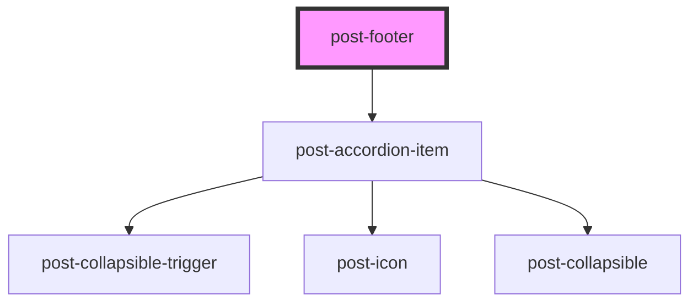

# post-footer

<!-- Auto Generated Below -->

## Properties

| Property             | Attribute | Description                                       | Type     | Default     |
| -------------------- | --------- | ------------------------------------------------- | -------- | ----------- |
| `label` _(required)_ | `label`   | The label to add to the footer (visually hidden). | `string` | `undefined` |

## Dependencies

### Depends on

- [post-accordion-item](../post-accordion-item)

### Graph

----------------------------------------------

*Built with [StencilJS](https://stenciljs.com/)*
