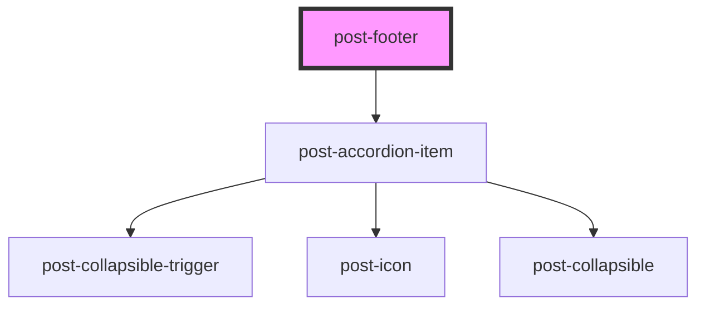

# post-footer

<!-- Auto Generated Below -->

## Properties

| Property             | Attribute | Description                                       | Type     | Default     |
| -------------------- | --------- | ------------------------------------------------- | -------- | ----------- |
| `label` _(required)_ | `label`   | The label to add to the footer (visually hidden). | `string` | `undefined` |

## Slots

| Slot                        | Description                                                                  |
| --------------------------- | ---------------------------------------------------------------------------- |
| `"app"`                     | Slot for the app links.                                                      |
| `"businesssectors"`         | Slot for the business sectors links.                                         |
| `"copyright"`               | Slot for the copyright text.                                                 |
| `"grid-{1\|2\|3\|4}"`       | Slot for the accordion bodies (mobile) and the grid cells (tablet, desktop). |
| `"grid-{1\|2\|3\|4}-title"` | Slot for the accordion headers (mobile).                                     |
| `"meta"`                    | Slot for the meta links.                                                     |
| `"socialmedia"`             | Slot for the social media links.                                             |

## Dependencies

### Depends on

- [post-accordion-item](../post-accordion-item)

### Graph

----------------------------------------------

*Built with [StencilJS](https://stenciljs.com/)*
