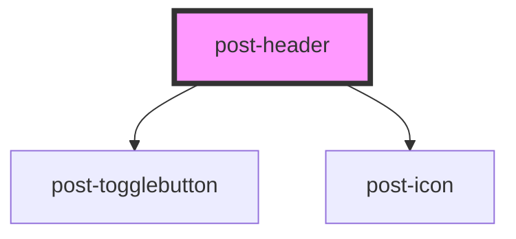

# post-header

<!-- Auto Generated Below -->

## Properties

| Property                       | Attribute           | Description                          | Type     | Default     |
| ------------------------------ | ------------------- | ------------------------------------ | -------- | ----------- |
| `labelBurgerMenu` _(required)_ | `label-burger-menu` | The label of the burger menu button. | `string` | `undefined` |

## Methods

### `toggleBurgerMenu(force?: boolean) => Promise<void>`

Toggles the burger navigation menu.

#### Parameters

| Name    | Type      | Description |
| ------- | --------- | ----------- |
| `force` | `boolean` |             |

#### Returns

Type: `Promise<void>`

## Slots

| Slot                     | Description                                                                   |
| ------------------------ | ----------------------------------------------------------------------------- |
| `"global-controls"`      | Holds search button in the global header.                                     |
| `"global-login"`         | Holds the user menu or login button in the global header.                     |
| `"local-nav"`            | Holds controls specific to the current application.                           |
| `"meta-navigation"`      | Holds an `<ul>` with meta navigation links.                                   |
| `"post-language-switch"` | Should be used with the `<post-language-switch>` component.                   |
| `"post-logo"`            | Should be used together with the `<post-logo>` component.                     |
| `"post-mainnavigation"`  | Has a default slot because it's only meant to be used in the `<post-header>`. |
| `"target-group"`         | Holds the list of buttons to choose the target group.                         |
| `"title"`                | Holds the application title.                                                  |

## Dependencies

### Depends on

- [post-togglebutton](../post-togglebutton)
- [post-icon](../post-icon)

### Graph

----------------------------------------------

*Built with [StencilJS](https://stenciljs.com/)*
