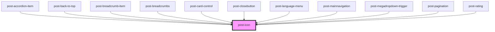

# post-icon

some content

<!-- Auto Generated Below -->

## Properties

| Property            | Attribute   | Description                                                                                                               | Type                                                                           | Default     |
| ------------------- | ----------- | ------------------------------------------------------------------------------------------------------------------------- | ------------------------------------------------------------------------------ | ----------- |
| `animation`         | `animation` | The name of the animation.                                                                                                | `"cylon" \| "cylon-vertical" \| "fade" \| "spin" \| "spin-reverse" \| "throb"` | `undefined` |
| `base`              | `base`      | The base path, where the icons are located (must be a public url). Leave this field empty to use the default cdn url. | `string`                                                                       | `undefined` |
| `flipH`             | `flip-h`    | When set to `true`, the icon will be flipped horizontally.                                                                | `boolean`                                                                      | `false`     |
| `flipV`             | `flip-v`    | When set to `true`, the icon will be flipped vertically.                                                                  | `boolean`                                                                      | `false`     |
| `name` _(required)_ | `name`      | The name/id of the icon (e.g. 1000, 1001, ...).                                                                           | `string`                                                                       | `undefined` |
| `rotate`            | `rotate`    | The number of degree for the css rotate transformation.                                                                   | `number`                                                                       | `undefined` |
| `scale`             | `scale`     | The number for the css scale transformation.                                                                              | `number`                                                                       | `undefined` |

## Dependencies

### Used by

- [post-accordion-item](../post-accordion-item)
- [post-back-to-top](../post-back-to-top)
- [post-breadcrumb-item](../post-breadcrumb-item)
- [post-breadcrumbs](../post-breadcrumbs)
- [post-card-control](../post-card-control)
- [post-closebutton](../post-closebutton)
- [post-language-menu](../post-language-menu)
- [post-mainnavigation](../post-mainnavigation)
- [post-megadropdown-trigger](../post-megadropdown-trigger)
- [post-pagination](../post-pagination)
- [post-rating](../post-rating)

### Graph

---

_Built with [StencilJS](https://stenciljs.com/)_
