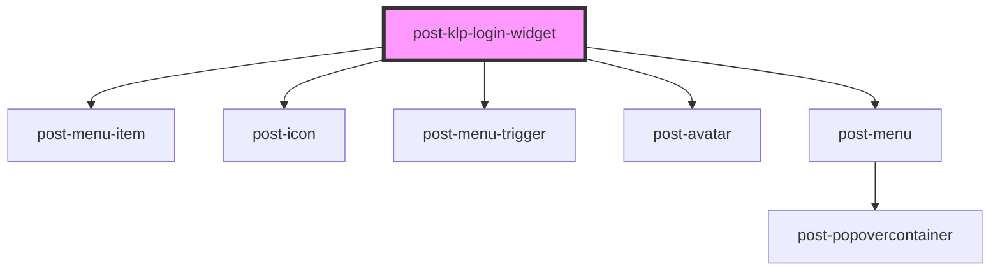

# post-klp-login-widget

<!-- Auto Generated Below -->

## Properties

| Property        | Attribute        | Description                                                                                                                                                   | Type                                                                      | Default       |
| --------------- | ---------------- | ------------------------------------------------------------------------------------------------------------------------------------------------------------- | ------------------------------------------------------------------------- | ------------- |
| `accountSwitch` | `account-switch` | Label and target for switching account. Only rendered when the session permits it, so the consumer does not have to work out who is allowed to see it.        | `KlpLink \| string`                                                       | `undefined`   |
| `companySwitch` | `company-switch` | Label and target for switching company. Only rendered when the session permits it.                                                                            | `KlpLink \| string`                                                       | `undefined`   |
| `config`        | `config`         | The portal login widget configuration. Accepts an object or, so the widget can be driven from plain HTML, a JSON string.                                      | `KlpLoginWidgetConfig \| string`                                          | `undefined`   |
| `environment`   | `environment`    | The KLP platform instance to talk to. Determines every backend URL the widget uses.                                                                           | `"dev01" \| "dev02" \| "devs1" \| "int01" \| "int02" \| "prod" \| "test"` | `'prod'`      |
| `loginLink`     | `login-link`     | The link offered to anonymous visitors. Falls back to the configured `appLoginUrl`. Ignored when the `login-link` slot is filled.                             | `KlpLink \| string`                                                       | `undefined`   |
| `logoutLink`    | `logout-link`    | The link that ends the session. Ignored when the `logout-link` slot is filled.                                                                                | `KlpLink \| string`                                                       | `undefined`   |
| `menuLinks`     | `menu-links`     | Links shown in the user menu, in order. Takes the output of internet-header's `getUserMenuOptions()` unchanged. Ignored when the `menu-links` slot is filled. | `KlpLink[] \| string`                                                     | `undefined`   |
| `textUserMenu`  | `text-user-menu` | Names the user menu for assistive technology.                                                                                                                 | `string`                                                                  | `'User menu'` |

## Dependencies

### Depends on

- [post-menu-item](../post-menu-item)
- [post-icon](../post-icon)
- [post-menu-trigger](../post-menu-trigger)
- [post-avatar](../post-avatar)
- [post-menu](../post-menu)

### Graph

----------------------------------------------

*Built with [StencilJS](https://stenciljs.com/)*
