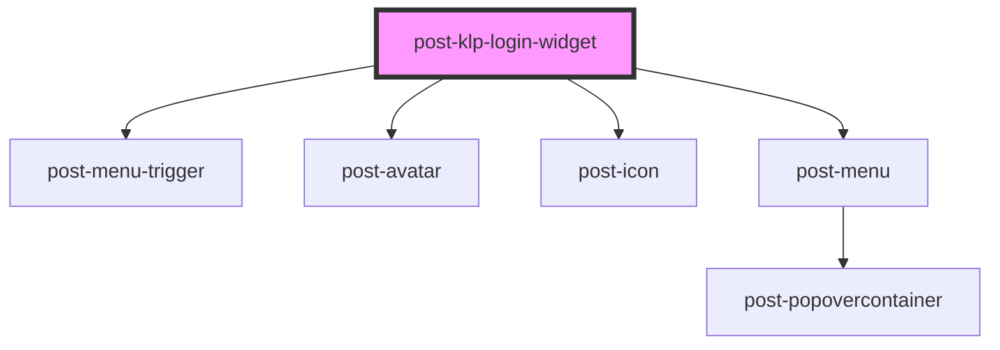

# post-klp-login-widget

<!-- Auto Generated Below -->

## Properties

| Property              | Attribute                | Description                                                                                                                               | Type                                                                      | Default                      |
| --------------------- | ------------------------ | ----------------------------------------------------------------------------------------------------------------------------------------- | ------------------------------------------------------------------------- | ---------------------------- |
| `applicationId`       | `application-id`         | The portal application the session belongs to.                                                                                            | `string`                                                                  | `undefined`                  |
| `environment`         | `environment`            | The KLP platform instance to talk to. Determines every backend URL the widget uses.                                                       | `"dev01" \| "dev02" \| "devs1" \| "int01" \| "int02" \| "prod" \| "test"` | `'prod'`                     |
| `keepAlive`           | `keep-alive`             | Whether the session is refreshed while the user is active on the page.                                                                    | `boolean`                                                                 | `true`                       |
| `keepAliveEvents`     | `keep-alive-events`      | Space separated list of the events that count as user activity.                                                                           | `string`                                                                  | `'click touchstart keydown'` |
| `keepAliveInterval`   | `keep-alive-interval`    | Minutes between two keep-alive ticks.                                                                                                     | `number`                                                                  | `9`                          |
| `keepAliveUrl`        | `keep-alive-url`         | The portal's own keep-alive url. The platform session is refreshed either way.                                                            | `string`                                                                  | `undefined`                  |
| `language`            | `language`               | Language the platform should answer in.                                                                                                   | `"de" \| "en" \| "fr" \| "it"`                                            | `undefined`                  |
| `project`             | `project`                | Your project id, the same one the header is given. Sent to the platform as the service id.                                                | `string`                                                                  | `undefined`                  |
| `textAccessUserLinks` | `text-access-user-links` | Visually hidden label for the button that opens the user menu.                                                                            | `string`                                                                  | `undefined`                  |
| `textCurrentUser`     | `text-current-user`      | Visually hidden label for the current user. The placeholder `{user}` will be replaced with the full name of the currently logged-in user. | `string`                                                                  | `undefined`                  |
| `textUserLinks`       | `text-user-links`        | Visually hidden label for the user menu.                                                                                                  | `string`                                                                  | `undefined`                  |

## Slots

| Slot               | Description                                                             |
| ------------------ | ----------------------------------------------------------------------- |
| `"account-switch"` | Entry for switching account, rendered only when the session permits it. |
| `"company-switch"` | Entry for switching company, rendered only when the session permits it. |
| `"login-link"`     | The link offered to anonymous visitors.                                 |
| `"logout-link"`    | The entry that ends the session.                                        |
| `"menu-links"`     | Entries of the user menu, as `post-menu-item` elements.                 |

## Dependencies

### Depends on

- [post-menu-trigger](../post-menu-trigger)
- [post-avatar](../post-avatar)
- [post-icon](../post-icon)
- [post-menu](../post-menu)

### Graph

----------------------------------------------

*Built with [StencilJS](https://stenciljs.com/)*
