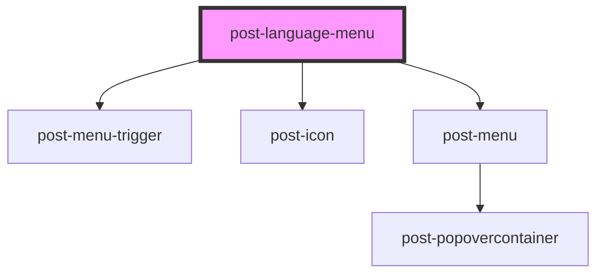

# post-language-switch

<!-- Auto Generated Below -->

## Properties

| Property                           | Attribute               | Description                                           | Type               | Default     |
| ---------------------------------- | ----------------------- | ----------------------------------------------------- | ------------------ | ----------- |
| `textChangeLanguage` _(required)_  | `text-change-language`  | A title for the list of language options              | `string`           | `undefined` |
| `textCurrentLanguage` _(required)_ | `text-current-language` | A descriptive text for the list of language options   | `string`           | `undefined` |
| `variant`                          | `variant`               | Whether the component is rendered as a list or a menu | `"list" \| "menu"` | `'list'`    |

## Dependencies

### Depends on

- [post-menu-trigger](../post-menu-trigger)
- [post-icon](../post-icon)
- [post-menu](../post-menu)

### Graph

---

_Built with [StencilJS](https://stenciljs.com/)_
