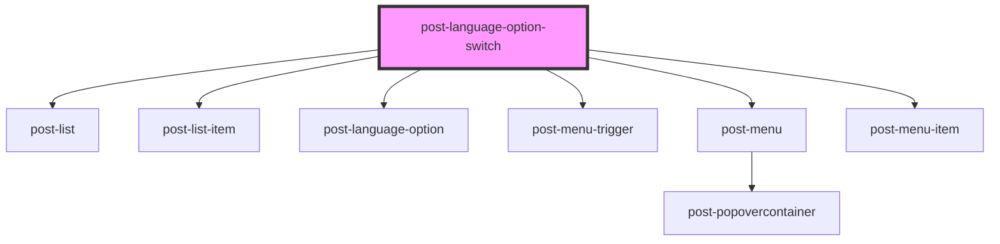

# post-language-option-switch

<!-- Auto Generated Below -->

## Properties

| Property      | Attribute     | Description                                                                                                                                                | Type                   | Default     |
| ------------- | ------------- | ---------------------------------------------------------------------------------------------------------------------------------------------------------- | ---------------------- | ----------- |
| `caption`     | `caption`     | A title for the list                                                                                                                                       | `string`               | `undefined` |
| `description` | `description` | A descriptive text for the list                                                                                                                            | `string`               | `undefined` |
| `mode`        | `mode`        | Mode determines if the language-switch navigates to a different page or just emits events                                                                  | `"event" \| "link"`    | `'link'`    |
| `variant`     | `variant`     | Variant that determines the rendering of the language switch either as a list (used on mobile in the header) or a dropdown (used on desktop in the header) | `"dropdown" \| "list"` | `'list'`    |

## Dependencies

### Depends on

- [post-list](../post-list)
- [post-list-item](../post-list-item)
- [post-language-option](../post-language-option)
- [post-menu-trigger](../post-menu-trigger)
- [post-menu](../post-menu)
- [post-menu-item](../post-menu-item)

### Graph

----------------------------------------------

*Built with [StencilJS](https://stenciljs.com/)*
