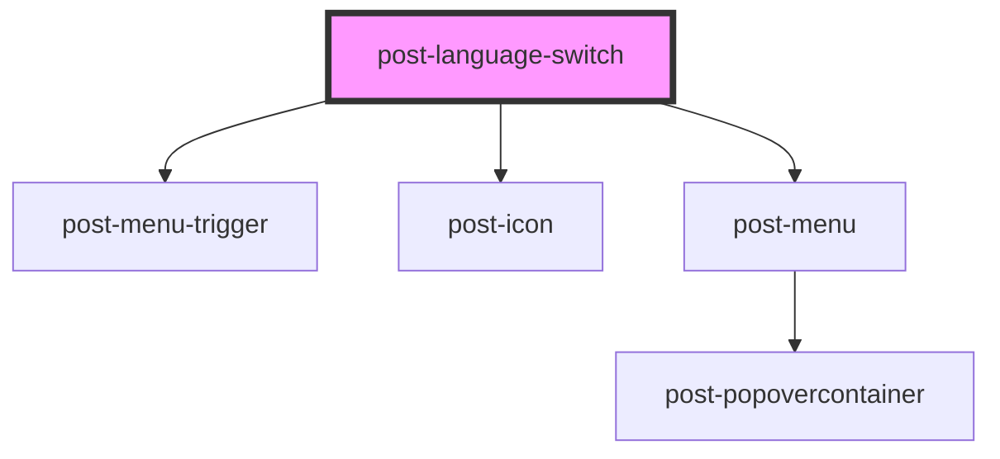

# post-language-switch

<!-- Auto Generated Below -->

## Properties

| Property      | Attribute     | Description                                                                                                               | Type                     | Default      |
| ------------- | ------------- | ------------------------------------------------------------------------------------------------------------------------- | ------------------------ | ------------ |
| `caption`     | `caption`     | A title for the list of language options                                                                                  | `string`                 | `undefined`  |
| `description` | `description` | A descriptive text for the list of language options                                                                       | `string`                 | `undefined`  |
| `type`        | `type`        | Whether the component is rendered with uppercased text and fix widths or without any text transformation and fluid widths | `"language" \| "region"` | `'language'` |
| `variant`     | `variant`     | Whether the component is rendered as a list or a menu                                                                     | `"list" \| "menu"`       | `'list'`     |

## Dependencies

### Depends on

- [post-menu-trigger](../post-menu-trigger)
- [post-icon](../post-icon)
- [post-menu](../post-menu)

### Graph

----------------------------------------------

*Built with [StencilJS](https://stenciljs.com/)*
