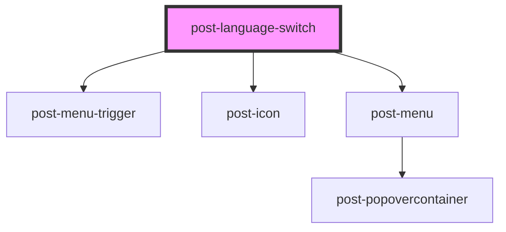

# post-language-switch

<!-- Auto Generated Below -->

## Properties

| Property      | Attribute     | Description                                                                                                                                                | Type                   | Default     |
| ------------- | ------------- | ---------------------------------------------------------------------------------------------------------------------------------------------------------- | ---------------------- | ----------- |
| `caption`     | `caption`     | A title for the list of language options                                                                                                                   | `string`               | `undefined` |
| `description` | `description` | A descriptive text for the list of language options                                                                                                        | `string`               | `undefined` |
| `name`        | `name`        | The name of the language switch, which will be used on the dropdown as an ID                                                                               | `string`               | `undefined` |
| `variant`     | `variant`     | Variant that determines the rendering of the language switch either as a list (used on mobile in the header) or a dropdown (used on desktop in the header) | `"dropdown" \| "list"` | `'list'`    |

## Dependencies

### Depends on

- [post-menu-trigger](../post-menu-trigger)
- [post-icon](../post-icon)
- [post-menu](../post-menu)

### Graph

----------------------------------------------

*Built with [StencilJS](https://stenciljs.com/)*
