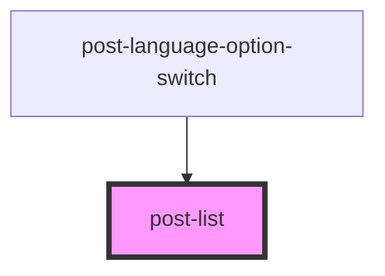

# post-list

<!-- Auto Generated Below -->

## Properties

| Property      | Attribute      | Description                                                                        | Type      | Default |
| ------------- | -------------- | ---------------------------------------------------------------------------------- | --------- | ------- |
| `horizontal`  | `horizontal`   | The list can become horizontal by setting `horizontal="true"` or just `horizontal` | `boolean` | `false` |
| `titleHidden` | `title-hidden` | If `true`, the list title will be hidden. Otherwise, it will be displayed.`        | `boolean` | `false` |

## Slots

| Slot               | Description                                 |
| ------------------ | ------------------------------------------- |
| `"default"`        | Slot for placing the list title.            |
| `"post-list-item"` | Slot for placing post-list-item components. |

## Dependencies

### Used by

 - [post-language-option-switch](../post-language-option-switch)

### Graph

----------------------------------------------

*Built with [StencilJS](https://stenciljs.com/)*
