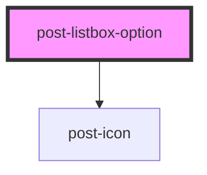

# post-accordion

<!-- Auto Generated Below -->

## Properties

| Property             | Attribute     | Description                                                                     | Type      | Default     |
| -------------------- | ------------- | ------------------------------------------------------------------------------- | --------- | ----------- |
| `highlighted`        | `highlighted` | Represents option is highlighted .                                              | `boolean` | `false`     |
| `selected`           | `selected`    | Represents option is selected .                                                 | `boolean` | `false`     |
| `value` _(required)_ | `value`       | A value string, similar to <option value="Value 1">Value 1 description</option> | `string`  | `undefined` |

## Events

| Event                | Description                                      | Type                  |
| -------------------- | ------------------------------------------------ | --------------------- |
| `postOptionSelected` | Fires when this option was selected. Bubbles up. | `CustomEvent<string>` |

## Dependencies

### Depends on

- [post-icon](../post-icon)

### Graph

----------------------------------------------

*Built with [StencilJS](https://stenciljs.com/)*
