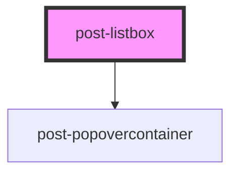

# post-listbox

<!-- Auto Generated Below -->

## Events

| Event               | Description                                | Type                                |
| ------------------- | ------------------------------------------ | ----------------------------------- |
| `postListboxToggle` | Fires when the listbox visibility changes. | `CustomEvent<{ isOpen: boolean; }>` |

## Methods

### `filter(query: string) => Promise<void>`

Filters the list of options using default text matching.
An empty string resets the filter to its original state.

#### Parameters

| Name    | Type     | Description                              |
| ------- | -------- | ---------------------------------------- |
| `query` | `string` | - The search query to filter options by. |

#### Returns

Type: `Promise<void>`

### `hide() => Promise<void>`

Hides the listbox popover.

#### Returns

Type: `Promise<void>`

### `show(target: HTMLElement) => Promise<void>`

Shows the listbox popover, positioning it relative to the given target element.

#### Parameters

| Name     | Type          | Description                                                         |
| -------- | ------------- | ------------------------------------------------------------------- |
| `target` | `HTMLElement` | - The element to anchor the popover to (typically the input field). |

#### Returns

Type: `Promise<void>`

## Slots

| Slot | Description                                        |
| ---- | -------------------------------------------------- |
|      | Default slot for `<post-listbox-option>` elements. |

## Dependencies

### Depends on

- [post-popovercontainer](../post-popovercontainer)

### Graph

----------------------------------------------

*Built with [StencilJS](https://stenciljs.com/)*
