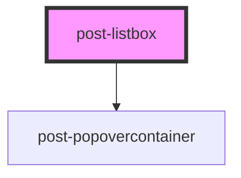

# post-listbox

<!-- Auto Generated Below -->

## Properties

| Property    | Attribute   | Description                                                  | Type                                                                                                                                                                 | Default    |
| ----------- | ----------- | ------------------------------------------------------------ | -------------------------------------------------------------------------------------------------------------------------------------------------------------------- | ---------- |
| `placement` | `placement` | Defines the position of the listbox relative to its trigger. | `"bottom" \| "bottom-end" \| "bottom-start" \| "left" \| "left-end" \| "left-start" \| "right" \| "right-end" \| "right-start" \| "top" \| "top-end" \| "top-start"` | `'bottom'` |

## Events

| Event             | Description                       | Type                |
| ----------------- | --------------------------------- | ------------------- |
| `postListboxHide` | Fires when the listbox is hidden. | `CustomEvent<void>` |
| `postListboxShow` | Fires when the listbox is shown.  | `CustomEvent<void>` |

## Methods

### `clearSelection() => Promise<void>`

Clears all selections in the listbox.

#### Returns

Type: `Promise<void>`

### `filter(query: string) => Promise<void>`

Filters the options based on a query string (case-insensitive substring match).
An empty string resets the filter.

#### Parameters

| Name    | Type     | Description                              |
| ------- | -------- | ---------------------------------------- |
| `query` | `string` | - The search query to filter options by. |

#### Returns

Type: `Promise<void>`

### `getOptions() => Promise<HTMLPostOptionElement[]>`

Returns all post-option elements in this listbox.

#### Returns

Type: `Promise<HTMLPostOptionElement[]>`

### `getVisibleOptions() => Promise<HTMLPostOptionElement[]>`

Returns all visible (non-hidden) post-option elements.

#### Returns

Type: `Promise<HTMLPostOptionElement[]>`

### `hide() => Promise<void>`

Hides the listbox.

#### Returns

Type: `Promise<void>`

### `setActiveOption(id: string | null) => Promise<void>`

Sets the active (highlighted) option by id.

#### Parameters

| Name | Type     | Description                                            |
| ---- | -------- | ------------------------------------------------------ |
| `id` | `string` | - The id of the option to highlight, or null to clear. |

#### Returns

Type: `Promise<void>`

### `show(target: HTMLElement) => Promise<void>`

Shows the listbox, positioning it relative to the target element.

#### Parameters

| Name     | Type          | Description                                        |
| -------- | ------------- | -------------------------------------------------- |
| `target` | `HTMLElement` | - The element to position the listbox relative to. |

#### Returns

Type: `Promise<void>`

### `toggle(target: HTMLElement) => Promise<void>`

Toggles the listbox visibility.

#### Parameters

| Name     | Type          | Description                                        |
| -------- | ------------- | -------------------------------------------------- |
| `target` | `HTMLElement` | - The element to position the listbox relative to. |

#### Returns

Type: `Promise<void>`

## Slots

| Slot            | Description                                                               |
| --------------- | ------------------------------------------------------------------------- |
| `"blank-slate"` | Content to display when no options are available or all are filtered out. |
| `"default"`     | Slot for `<post-option>` elements.                                        |

## Dependencies

### Depends on

- [post-popovercontainer](../post-popovercontainer)

### Graph

```mermaid
graph TD;
  post-listbox --> post-popovercontainer
  style post-listbox fill:#f9f,stroke:#333,stroke-width:4px
```

----------------------------------------------

*Built with [StencilJS](https://stenciljs.com/)*
