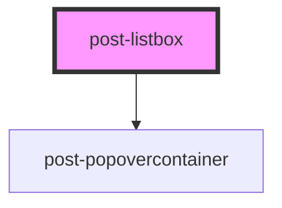

# post-accordion

<!-- Auto Generated Below -->

## Events

| Event              | Description                             | Type                  |
| ------------------ | --------------------------------------- | --------------------- |
| `postOptionActive` | Emitted option id for the active option | `CustomEvent<string>` |

## Methods

### `clearSelection() => Promise<void>`

Clears the currently selected option

#### Returns

Type: `Promise<void>`

### `filter(query: string) => Promise<void>`

Uses the internal default filtering mode to filter the list of options.
An empty string resets the filter to it's original state.

#### Parameters

| Name    | Type     | Description |
| ------- | -------- | ----------- |
| `query` | `string` |             |

#### Returns

Type: `Promise<void>`

### `hide() => Promise<void>`

Closes the listbox

#### Returns

Type: `Promise<void>`

### `navigate(direction: "up" | "down" | "first" | "last") => Promise<void>`

Navigates the listbox options in the specified direction and scrolls the active option into view.

#### Parameters

| Name        | Type                                  | Description |
| ----------- | ------------------------------------- | ----------- |
| `direction` | `"up" \| "down" \| "first" \| "last"` |             |

#### Returns

Type: `Promise<void>`

### `selectActive() => Promise<void>`

Selects the currently highlighted option in the listbox and scrolls it into view.

#### Returns

Type: `Promise<void>`

### `show() => Promise<void>`

Opens the listbox

#### Returns

Type: `Promise<void>`

## Dependencies

### Depends on

- [post-popovercontainer](../post-popovercontainer)

### Graph

```mermaid
graph TD;
  post-listbox --> post-popovercontainer
  style post-listbox fill:#f9f,stroke:#333,stroke-width:4px
```

----------------------------------------------

*Built with [StencilJS](https://stenciljs.com/)*
