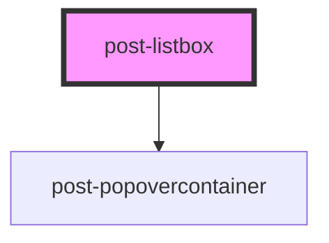

# post-listbox

<!-- Auto Generated Below -->

## Methods

### `filter(query: string) => Promise<number>`

Filter child `post-option` elements by matching their text content
against the query string (case-insensitive substring match).
Returns the count of visible (matching) options.

#### Parameters

| Name    | Type     | Description |
| ------- | -------- | ----------- |
| `query` | `string` |             |

#### Returns

Type: `Promise<number>`

### `getVisibleOptions() => Promise<HTMLElement[]>`

Returns an array of currently visible `post-option` elements.

#### Returns

Type: `Promise<HTMLElement[]>`

### `hide() => Promise<void>`

Hide the dropdown popover.

#### Returns

Type: `Promise<void>`

### `resetFilter() => Promise<void>`

Remove all filter state and make all options visible again.

#### Returns

Type: `Promise<void>`

### `show(target: HTMLElement) => Promise<void>`

Show the dropdown popover.

#### Parameters

| Name     | Type          | Description |
| -------- | ------------- | ----------- |
| `target` | `HTMLElement` |             |

#### Returns

Type: `Promise<void>`

### `updateVisibility() => Promise<void>`

Sync the internal `visibleCount` and `isEmpty` state with the current
DOM visibility of options. Call this after performing custom/external
filtering to keep the blank-slate and live-region announcements correct.

#### Returns

Type: `Promise<void>`

## Slots

| Slot            | Description                                                  |
| --------------- | ------------------------------------------------------------ |
| `"blank-slate"` | Content to display when no options match the current filter. |
| `"default"`     | Slot for `post-option` elements.                             |

## Dependencies

### Depends on

- [post-popovercontainer](../post-popovercontainer)

### Graph

```mermaid
graph TD;
  post-listbox --> post-popovercontainer
  style post-listbox fill:#f9f,stroke:#333,stroke-width:4px
```

----------------------------------------------

*Built with [StencilJS](https://stenciljs.com/)*
