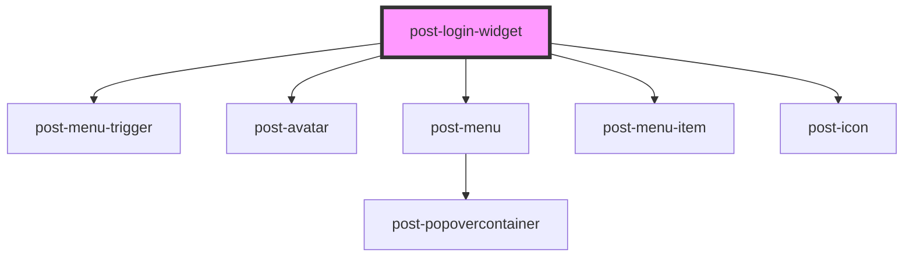

# post-login-widget

<!-- Auto Generated Below -->

## Properties

| Property                       | Attribute           | Description                                                                                                                               | Type     | Default     |
| ------------------------------ | ------------------- | ----------------------------------------------------------------------------------------------------------------------------------------- | -------- | ----------- |
| `loginUrl` _(required)_        | `login-url`         | The URL to redirect to when the user clicks the login link.                                                                               | `string` | `undefined` |
| `logoutUrl` _(required)_       | `logout-url`        | The URL to redirect to after the user logs out. Emitted as the payload of the `postLogout` event so the consumer can handle the redirect. | `string` | `undefined` |
| `textLogout` _(required)_      | `text-logout`       | Label for the "Logout" button.                                                                                                            | `string` | `undefined` |
| `textMenuLabel` _(required)_   | `text-menu-label`   | Accessible label for the user menu.                                                                                                       | `string` | `undefined` |
| `textMessages` _(required)_    | `text-messages`     | Label for the "Messages" menu item.                                                                                                       | `string` | `undefined` |
| `textSettings` _(required)_    | `text-settings`     | Label for the "Settings" menu item.                                                                                                       | `string` | `undefined` |
| `textUserProfile` _(required)_ | `text-user-profile` | Label for the "My Profile" menu item.                                                                                                     | `string` | `undefined` |

## Events

| Event        | Description                                                                                                                                   | Type                  |
| ------------ | --------------------------------------------------------------------------------------------------------------------------------------------- | --------------------- |
| `postLogout` | Emitted when the user clicks the logout button. The event payload is the `logoutUrl` — the consumer is responsible for handling the redirect. | `CustomEvent<string>` |

## Dependencies

### Depends on

- [post-menu-trigger](../post-menu-trigger)
- [post-avatar](../post-avatar)
- [post-menu](../post-menu)
- [post-menu-item](../post-menu-item)
- [post-icon](../post-icon)

### Graph

----------------------------------------------

*Built with [StencilJS](https://stenciljs.com/)*
