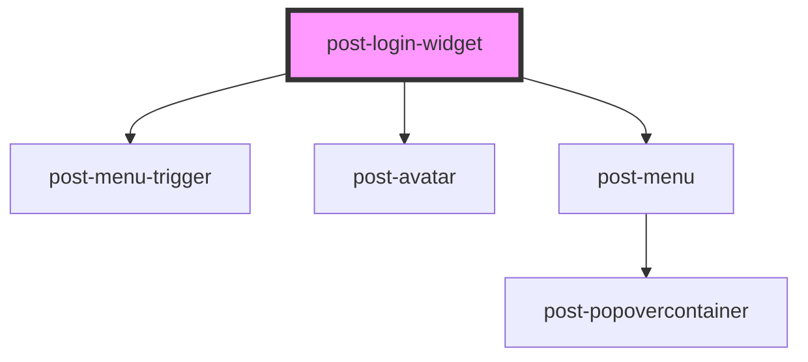

# post-login-widget

<!-- Auto Generated Below -->

## Properties

| Property                           | Attribute                | Description                                                                                                                                                    | Type     | Default     |
| ---------------------------------- | ------------------------ | -------------------------------------------------------------------------------------------------------------------------------------------------------------- | -------- | ----------- |
| `textCurrentUser` _(required)_     | `text-current-user`      | Label for the "Current user is {user}" accessibility description. Use `{user}` as a placeholder — it will be replaced with the current user's name at runtime. | `string` | `undefined` |
| `textUserMenuTrigger` _(required)_ | `text-user-menu-trigger` | Hidden label for the user menu trigger button, for accessibility purposes. It should describe the purpose of the button (e.g. "Access user links").            | `string` | `undefined` |

## Events

| Event        | Description                                                                                                                                                                                                          | Type                                       |
| ------------ | -------------------------------------------------------------------------------------------------------------------------------------------------------------------------------------------------------------------- | ------------------------------------------ |
| `postChange` | Emitted when the authentication state changes. The event payload is an object with an `authenticated` property: `true` when the user is logged in, `false` when the user is not logged in or the API request failed. | `CustomEvent<{ authenticated: boolean; }>` |

## Methods

### `isAuthenticated() => Promise<boolean | null>`

Returns the current authentication state:
`null` when the component is still loading, `true` when authenticated, `false` when not.

#### Returns

Type: `Promise<boolean>`

### `refresh() => Promise<void>`

Re-fetches the authentication state from the session API and updates
the component rendering accordingly.

#### Returns

Type: `Promise<void>`

## Slots

| Slot           | Description                                                    |
| -------------- | -------------------------------------------------------------- |
| `"login-link"` | Content rendered when the user is not authenticated.           |
| `"user-links"` | Links to show in the user menu when the user is authenticated. |

## Dependencies

### Depends on

- [post-menu-trigger](../post-menu-trigger)
- [post-avatar](../post-avatar)
- [post-menu](../post-menu)

### Graph

----------------------------------------------

*Built with [StencilJS](https://stenciljs.com/)*
