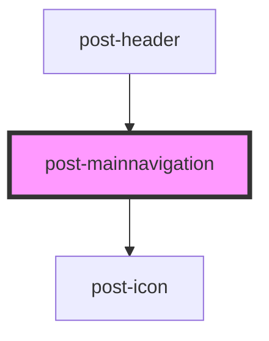

# post-mainnavigation

<!-- Auto Generated Below -->

## Properties

| Property    | Attribute | Description | Type                    | Default     |
| ----------- | --------- | ----------- | ----------------------- | ----------- |
| `headerRef` | --        |             | `HTMLPostHeaderElement` | `undefined` |

## Dependencies

### Used by

 - [post-header](../post-header)

### Depends on

- [post-icon](../post-icon)

### Graph

----------------------------------------------

*Built with [StencilJS](https://stenciljs.com/)*
