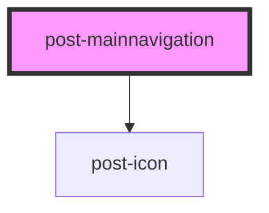

# post-mainnavigation

<!-- Auto Generated Below -->

## Properties

| Property                | Attribute   | Description                                                                                                                                                                             | Type     | Default     |
| ----------------------- | ----------- | --------------------------------------------------------------------------------------------------------------------------------------------------------------------------------------- | -------- | ----------- |
| `textMain` _(required)_ | `text-main` | Defines the accessible label for the navigation element. This text is used as the `aria-label` attribute to provide screen reader users with a description of the navigation's purpose. | `string` | `undefined` |

## Dependencies

### Depends on

- [post-icon](../post-icon)

### Graph

----------------------------------------------

*Built with [StencilJS](https://stenciljs.com/)*
