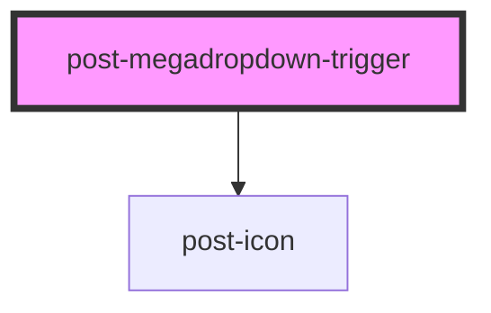

# post-megadropdown-toggle

<!-- Auto Generated Below -->

## Properties

| Property           | Attribute | Description                                                                                                         | Type      | Default     |
| ------------------ | --------- | ------------------------------------------------------------------------------------------------------------------- | --------- | ----------- |
| `active`           | `active`  | Sets the trigger state to be active or inactive.                                                                    | `boolean` | `false`     |
| `for` _(required)_ | `for`     | ID of the mega dropdown element that this trigger is linked to. Used to open and close the specified mega dropdown. | `string`  | `undefined` |

## Dependencies

### Depends on

- [post-icon](../post-icon)

### Graph

----------------------------------------------

*Built with [StencilJS](https://stenciljs.com/)*
