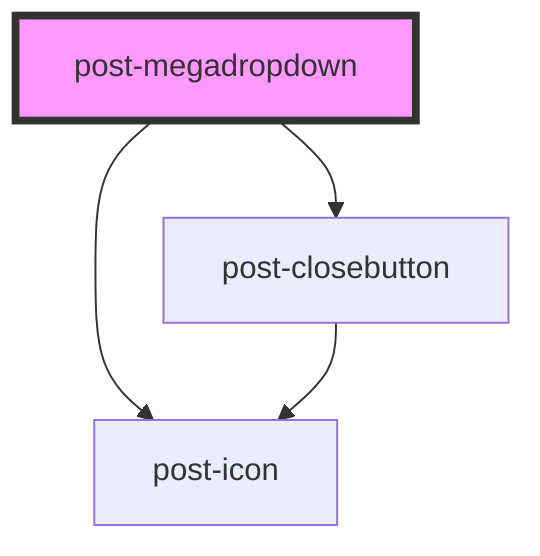

# post-megadropdown

<!-- Auto Generated Below -->

## Properties

| Property                 | Attribute    | Description                                                 | Type     | Default     |
| ------------------------ | ------------ | ----------------------------------------------------------- | -------- | ----------- |
| `textBack` _(required)_  | `text-back`  | A label for the back button visible on tablet and mobile    | `string` | `undefined` |
| `textClose` _(required)_ | `text-close` | An accessible label for the close button visible on desktop | `string` | `undefined` |

## Events

| Event                    | Description                                                                                                                                                                                                                                                                                                                                   | Type                                                          |
| ------------------------ | --------------------------------------------------------------------------------------------------------------------------------------------------------------------------------------------------------------------------------------------------------------------------------------------------------------------------------------------- | ------------------------------------------------------------- |
| `postToggleMegadropdown` | Emits when the dropdown is shown or hidden. The event payload is an object. `isVisible` is true when the dropdown gets opened and false when it gets closed `focusParent` determines whether after the closing of the mega dropdown, the focus should go back to the trigger parent or naturally go to the next focusable element in the page | `CustomEvent<{ isVisible: boolean; focusParent?: boolean; }>` |

## Methods

### `focusFirst() => Promise<void>`

Sets focus to the first focusable element within the component.

#### Returns

Type: `Promise<void>`

### `hide(focusParent?: boolean, forceClose?: boolean) => Promise<void>`

Hides the dropdown with an animation.

#### Parameters

| Name          | Type      | Description |
| ------------- | --------- | ----------- |
| `focusParent` | `boolean` |             |
| `forceClose`  | `boolean` |             |

#### Returns

Type: `Promise<void>`

### `show() => Promise<void>`

Displays the dropdown.

#### Returns

Type: `Promise<void>`

### `toggle() => Promise<void>`

Toggles the dropdown visibility based on its current state.

#### Returns

Type: `Promise<void>`

## Dependencies

### Depends on

- [post-closebutton](../post-closebutton)
- [post-icon](../post-icon)

### Graph

----------------------------------------------

*Built with [StencilJS](https://stenciljs.com/)*
