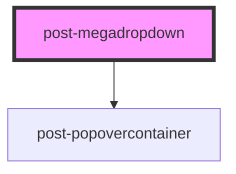

# post-megadropdown

<!-- Auto Generated Below -->

## Methods

### `hide() => Promise<void>`

Hide megadropdown

#### Returns

Type: `Promise<void>`

boolean

### `show(element: HTMLElement) => Promise<void>`

Show megadropdown

#### Parameters

| Name      | Type          | Description |
| --------- | ------------- | ----------- |
| `element` | `HTMLElement` | HTMLElement |

#### Returns

Type: `Promise<void>`

boolean

### `toggle(element: HTMLElement, force?: boolean) => Promise<boolean>`

Toggle megadropdown

#### Parameters

| Name      | Type          | Description |
| --------- | ------------- | ----------- |
| `element` | `HTMLElement` | HTMLElement |
| `force`   | `boolean`     | boolean     |

#### Returns

Type: `Promise<boolean>`

boolean

## Dependencies

### Depends on

- [post-popovercontainer](../post-popovercontainer)

### Graph

----------------------------------------------

*Built with [StencilJS](https://stenciljs.com/)*
