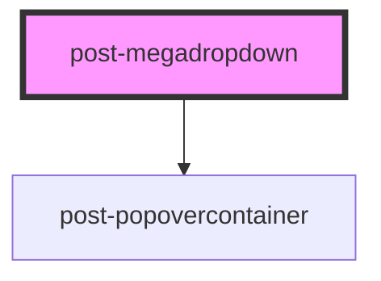

# post-megadropdown

<!-- Auto Generated Below -->

## Events

| Event                | Description                                                                                                                                  | Type                   |
| -------------------- | -------------------------------------------------------------------------------------------------------------------------------------------- | ---------------------- |
| `toggleMegadropdown` | Emits when the dropdown is shown or hidden. The event payload is a boolean: `true` when the dropdown was opened, `false` when it was closed. | `CustomEvent<boolean>` |

## Methods

### `hide() => Promise<void>`

Hides the popover dropdown

#### Returns

Type: `Promise<void>`

### `show(target: HTMLElement) => Promise<void>`

Displays the popover dropdown

#### Parameters

| Name     | Type          | Description                                                                    |
| -------- | ------------- | ------------------------------------------------------------------------------ |
| `target` | `HTMLElement` | - The HTML element relative to which the popover dropdown should be displayed. |

#### Returns

Type: `Promise<void>`

### `toggle(target: HTMLElement) => Promise<void>`

Toggles the dropdown visibility based on its current state.

#### Parameters

| Name     | Type          | Description |
| -------- | ------------- | ----------- |
| `target` | `HTMLElement` |             |

#### Returns

Type: `Promise<void>`

## Dependencies

### Depends on

- [post-popovercontainer](../post-popovercontainer)

### Graph

----------------------------------------------

*Built with [StencilJS](https://stenciljs.com/)*
