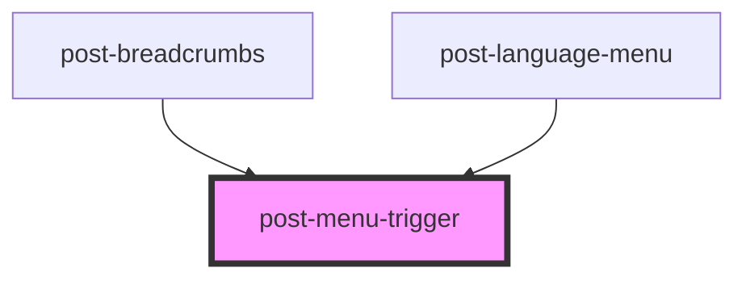

# post-menu-trigger

<!-- Auto Generated Below -->

## Properties

| Property           | Attribute | Description                                                                                       | Type     | Default     |
| ------------------ | --------- | ------------------------------------------------------------------------------------------------- | -------- | ----------- |
| `for` _(required)_ | `for`     | ID of the menu element that this trigger is linked to. Used to open and close the specified menu. | `string` | `undefined` |

## Dependencies

### Used by

- [post-breadcrumbs](../post-breadcrumbs)
- [post-language-menu](../post-language-menu)

### Graph

---

_Built with [StencilJS](https://stenciljs.com/)_
