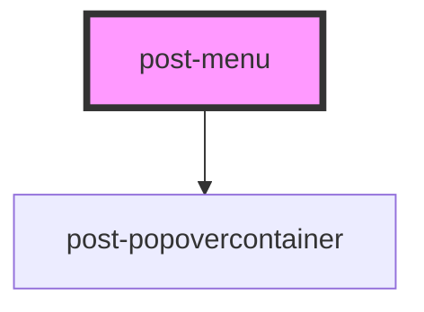

# post-menu

<!-- Auto Generated Below -->

## Properties

| Property    | Attribute   | Description | Type                                                                                                                                                                 | Default    |
| ----------- | ----------- | ----------- | -------------------------------------------------------------------------------------------------------------------------------------------------------------------- | ---------- |
| `placement` | `placement` |             | `"bottom" \| "bottom-end" \| "bottom-start" \| "left" \| "left-end" \| "left-start" \| "right" \| "right-end" \| "right-start" \| "top" \| "top-end" \| "top-start"` | `'bottom'` |

## Events

| Event        | Description | Type                   |
| ------------ | ----------- | ---------------------- |
| `toggleMenu` |             | `CustomEvent<boolean>` |

## Methods

### `hide() => Promise<void>`

Hides the popover menu and restores focus to the previously focused element.
If the popover is successfully hidden, it triggers the `toggleMenu` event.

#### Returns

Type: `Promise<void>`

### `show(target: HTMLElement) => Promise<void>`

Displays the popover menu, positioning it relative to the specified target element.

#### Parameters

| Name     | Type          | Description                                                                |
| -------- | ------------- | -------------------------------------------------------------------------- |
| `target` | `HTMLElement` | - The HTML element relative to which the popover menu should be displayed. |

#### Returns

Type: `Promise<void>`

### `toggle(target: HTMLElement) => Promise<void>`

Programmatically toggle the menu visibility.
If the menu is currently visible, it will be hidden; otherwise, it will be shown.

#### Parameters

| Name     | Type          | Description |
| -------- | ------------- | ----------- |
| `target` | `HTMLElement` |             |

#### Returns

Type: `Promise<void>`

## Dependencies

### Depends on

- [post-popovercontainer](../post-popovercontainer)

### Graph

----------------------------------------------

*Built with [StencilJS](https://stenciljs.com/)*
