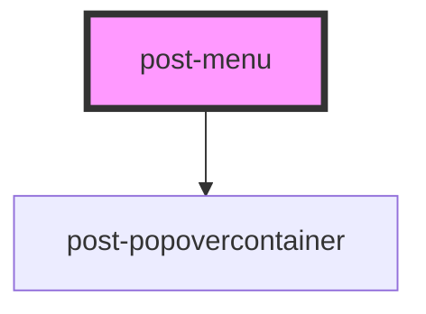

# post-menu

<!-- Auto Generated Below -->

## Properties

| Property    | Attribute   | Description                                                                                                                                    | Type                                                                                                                                                                 | Default    |
| ----------- | ----------- | ---------------------------------------------------------------------------------------------------------------------------------------------- | -------------------------------------------------------------------------------------------------------------------------------------------------------------------- | ---------- |
| `placement` | `placement` | Defines the placement of the popover according to the floating-ui options available at https://floating-ui.com/docs/computePosition#placement. | `"bottom" \| "bottom-end" \| "bottom-start" \| "left" \| "left-end" \| "left-start" \| "right" \| "right-end" \| "right-start" \| "top" \| "top-end" \| "top-start"` | `'bottom'` |

## Events

| Event        | Description                                                                                                                          | Type                   |
| ------------ | ------------------------------------------------------------------------------------------------------------------------------------ | ---------------------- |
| `toggleMenu` | Emits when the menu is shown or hidden. The event payload is a boolean: `true` when the menu was opened, `false` when it was closed. | `CustomEvent<boolean>` |

## Methods

### `toggle(target: HTMLElement) => Promise<void>`

Programmatically display or hide the menu based on current visibility.

#### Parameters

| Name     | Type          | Description |
| -------- | ------------- | ----------- |
| `target` | `HTMLElement` |             |

#### Returns

Type: `Promise<void>`

## Slots

| Slot        | Description                               |
| ----------- | ----------------------------------------- |
| `"default"` | Slot for placing content inside the menu. |

## Dependencies

### Depends on

- [post-popovercontainer](../post-popovercontainer)

### Graph

----------------------------------------------

*Built with [StencilJS](https://stenciljs.com/)*
