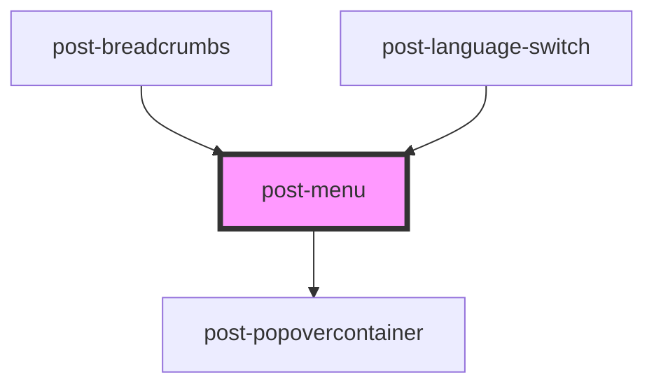

# post-menu

<!-- Auto Generated Below -->

## Properties

| Property    | Attribute   | Description                                                                                                                                                                                                                                                                                                                                                                         | Type                                                                                                                                                                 | Default     |
| ----------- | ----------- | ----------------------------------------------------------------------------------------------------------------------------------------------------------------------------------------------------------------------------------------------------------------------------------------------------------------------------------------------------------------------------------- | -------------------------------------------------------------------------------------------------------------------------------------------------------------------- | ----------- |
| `label`     | `label`     | An accessible name for the menu.                                                                                                                                                                                                                                                                                                                                                    | `string`                                                                                                                                                             | `undefined` |
| `placement` | `placement` | Defines the position of the menu relative to its trigger. Menus are automatically flipped to the opposite side if there is not enough available space and are shifted towards the viewport if they would overlap edge boundaries. For supported values and behavior details, see the [Floating UI placement documentation](https://floating-ui.com/docs/computePosition#placement). | `"bottom" \| "bottom-end" \| "bottom-start" \| "left" \| "left-end" \| "left-start" \| "right" \| "right-end" \| "right-start" \| "top" \| "top-end" \| "top-start"` | `'bottom'`  |

## Events

| Event        | Description                                                                                                                          | Type                   |
| ------------ | ------------------------------------------------------------------------------------------------------------------------------------ | ---------------------- |
| `toggleMenu` | Emits when the menu is shown or hidden. The event payload is a boolean: `true` when the menu was opened, `false` when it was closed. | `CustomEvent<boolean>` |

## Methods

### `hide() => Promise<void>`

Hides the popover menu and restores focus to the previously focused element.

#### Returns

Type: `Promise<void>`

### `show(target: HTMLElement) => Promise<void>`

Displays the popover menu, focusing the first menu item.

#### Parameters

| Name     | Type          | Description                                                                |
| -------- | ------------- | -------------------------------------------------------------------------- |
| `target` | `HTMLElement` | - The HTML element relative to which the popover menu should be displayed. |

#### Returns

Type: `Promise<void>`

### `toggle(target: HTMLElement) => Promise<void>`

Toggles the menu visibility based on its current state.

#### Parameters

| Name     | Type          | Description |
| -------- | ------------- | ----------- |
| `target` | `HTMLElement` |             |

#### Returns

Type: `Promise<void>`

## Shadow Parts

| Part     | Description                                              |
| -------- | -------------------------------------------------------- |
| `"menu"` | The container element that holds the list of menu items. |

## Dependencies

### Used by

 - [post-breadcrumbs](../post-breadcrumbs)
 - [post-language-switch](../post-language-switch)

### Depends on

- [post-popovercontainer](../post-popovercontainer)

### Graph

----------------------------------------------

*Built with [StencilJS](https://stenciljs.com/)*
