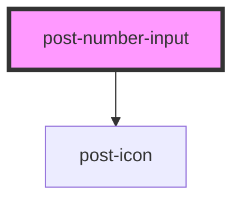

# post-number-input

<!-- Auto Generated Below -->

## Properties

| Property        | Attribute        | Description                                                                | Type     | Default   |
| --------------- | ---------------- | -------------------------------------------------------------------------- | -------- | --------- |
| `decrementIcon` | `decrement-icon` | The icon to be used in the control that decreases the number in the input. | `string` | `'minus'` |
| `incrementIcon` | `increment-icon` | The icon to be used in the control that increases the number in the input. | `string` | `'plus'`  |

## Dependencies

### Depends on

- [post-icon](../post-icon)

### Graph

----------------------------------------------

*Built with [StencilJS](https://stenciljs.com/)*
