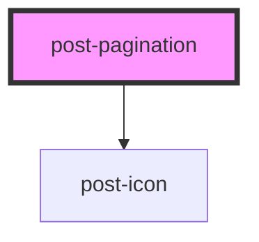

# post-pagination

<!-- Auto Generated Below -->

## Properties

| Property                      | Attribute         | Description                                                                        | Type      | Default     |
| ----------------------------- | ----------------- | ---------------------------------------------------------------------------------- | --------- | ----------- |
| `collectionSize` _(required)_ | `collection-size` | The total number of items in the collection.                                       | `number`  | `undefined` |
| `disabled`                    | `disabled`        | If true, the pagination is disabled.                                               | `boolean` | `undefined` |
| `label` _(required)_          | `label`           | A descriptive label for the pagination navigation, used by assistive technologies. | `string`  | `undefined` |
| `page`                        | `page`            | The current active page number.  **If not specified, defaults to the first page.** | `number`  | `undefined` |
| `pageSize` _(required)_       | `page-size`       | The number of items per page.                                                      | `number`  | `undefined` |
| `textFirst` _(required)_      | `text-first`      | Prefix text for the first page label.                                              | `string`  | `undefined` |
| `textLast` _(required)_       | `text-last`       | Prefix text for the last page label.                                               | `string`  | `undefined` |
| `textNext` _(required)_       | `text-next`       | Accessible label for the next page button.                                         | `string`  | `undefined` |
| `textPage` _(required)_       | `text-page`       | Prefix text for page number labels.                                                | `string`  | `undefined` |
| `textPrevious` _(required)_   | `text-previous`   | Accessible label for the previous page button.                                     | `string`  | `undefined` |

## Events

| Event        | Description                          | Type                  |
| ------------ | ------------------------------------ | --------------------- |
| `postChange` | Event emitted when the page changes. | `CustomEvent<number>` |

## Dependencies

### Depends on

- [post-icon](../post-icon)

### Graph

----------------------------------------------

*Built with [StencilJS](https://stenciljs.com/)*
