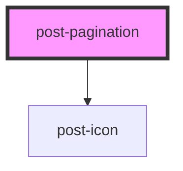

# post-popover

<!-- Auto Generated Below -->

## Properties

| Property         | Attribute         | Description                                     | Type      | Default        |
| ---------------- | ----------------- | ----------------------------------------------- | --------- | -------------- |
| `ariaLabel`      | `aria-label`      | Accessible label for the pagination navigation. | `string`  | `'Pagination'` |
| `collectionSize` | `collection-size` | The total number of items in the collection.    | `number`  | `0`            |
| `disabled`       | `disabled`        | If true, the pagination is disabled.            | `boolean` | `false`        |
| `page`           | `page`            | The current active page number (1-indexed).     | `number`  | `1`            |
| `pageSize`       | `page-size`       | The number of items per page.                   | `number`  | `10`           |

## Events

| Event        | Description                                                          | Type                  |
| ------------ | -------------------------------------------------------------------- | --------------------- |
| `postChange` | Event emitted when the page changes. Payload is the new page number. | `CustomEvent<number>` |

## Dependencies

### Depends on

- [post-icon](../post-icon)

### Graph

----------------------------------------------

*Built with [StencilJS](https://stenciljs.com/)*
