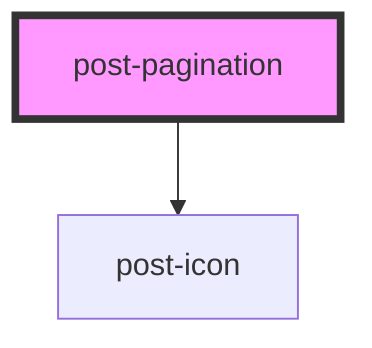

# post-popover

<!-- Auto Generated Below -->

## Properties

| Property                      | Attribute         | Description                                     | Type      | Default     |
| ----------------------------- | ----------------- | ----------------------------------------------- | --------- | ----------- |
| `collectionSize` _(required)_ | `collection-size` | The total number of items in the collection.    | `number`  | `undefined` |
| `disabled`                    | `disabled`        | If true, the pagination is disabled.            | `boolean` | `false`     |
| `label` _(required)_          | `label`           | Accessible label for the pagination navigation. | `string`  | `undefined` |
| `labelFirst` _(required)_     | `label-first`     | Prefix text for the first page label.           | `string`  | `undefined` |
| `labelLast` _(required)_      | `label-last`      | Prefix text for the last page label.            | `string`  | `undefined` |
| `labelNext` _(required)_      | `label-next`      | Accessible label for the next page button.      | `string`  | `undefined` |
| `labelPage` _(required)_      | `label-page`      | Prefix text for page number labels.             | `string`  | `undefined` |
| `labelPrevious` _(required)_  | `label-previous`  | Accessible label for the previous page button.  | `string`  | `undefined` |
| `page`                        | `page`            | The current active page number.                 | `number`  | `undefined` |
| `pageSize` _(required)_       | `page-size`       | The number of items per page.                   | `number`  | `undefined` |

## Events

| Event        | Description                          | Type                  |
| ------------ | ------------------------------------ | --------------------- |
| `postChange` | Event emitted when the page changes. | `CustomEvent<number>` |

## Dependencies

### Depends on

- [post-icon](../post-icon)

### Graph

----------------------------------------------

*Built with [StencilJS](https://stenciljs.com/)*
