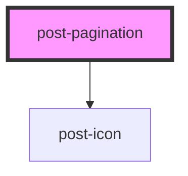

# post-popover

<!-- Auto Generated Below -->

## Properties

| Property             | Attribute         | Description                                     | Type      | Default           |
| -------------------- | ----------------- | ----------------------------------------------- | --------- | ----------------- |
| `collectionSize`     | `collection-size` | The total number of items in the collection.    | `number`  | `0`               |
| `disabled`           | `disabled`        | If true, the pagination is disabled.            | `boolean` | `false`           |
| `label` _(required)_ | `label`           | Accessible label for the pagination navigation. | `string`  | `undefined`       |
| `labelFirst`         | `label-first`     | Prefix text for the first page label.           | `string`  | `'First page'`    |
| `labelLast`          | `label-last`      | Prefix text for the last page label.            | `string`  | `'Last page'`     |
| `labelNext`          | `label-next`      | Accessible label for the next page button.      | `string`  | `'Next page'`     |
| `labelPage`          | `label-page`      | Prefix text for page number labels.             | `string`  | `'Page'`          |
| `labelPrevious`      | `label-previous`  | Accessible label for the previous page button.  | `string`  | `'Previous page'` |
| `page`               | `page`            | The current active page number (1-indexed).     | `number`  | `1`               |
| `pageSize`           | `page-size`       | The number of items per page.                   | `number`  | `undefined`       |

## Events

| Event        | Description                          | Type                  |
| ------------ | ------------------------------------ | --------------------- |
| `postChange` | Event emitted when the page changes. | `CustomEvent<number>` |

## Dependencies

### Depends on

- [post-icon](../post-icon)

### Graph

----------------------------------------------

*Built with [StencilJS](https://stenciljs.com/)*
