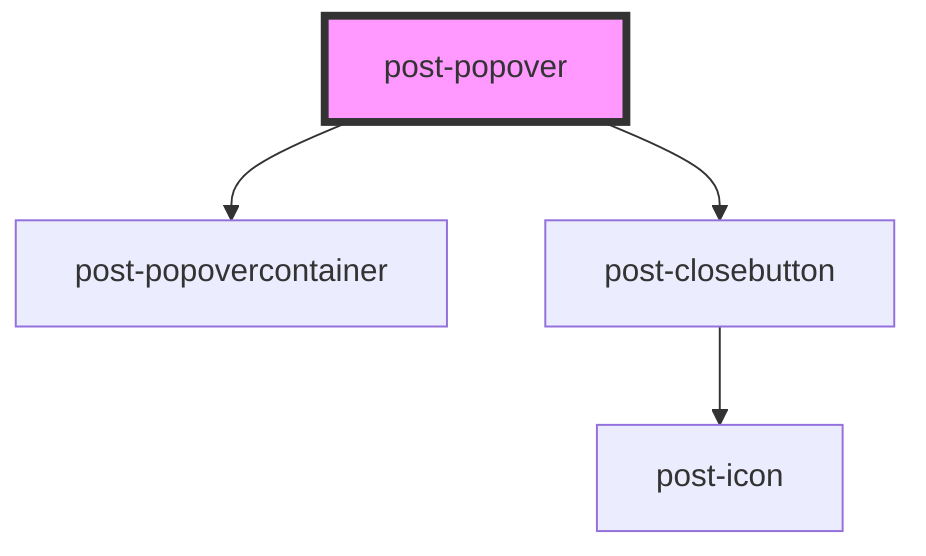

# post-popover

<!-- Auto Generated Below -->

## Properties

| Property                 | Attribute    | Description                                                                                                                                                                                                                                                                                                                                                                               | Type                                                                                                                                                                 | Default     |
| ------------------------ | ------------ | ----------------------------------------------------------------------------------------------------------------------------------------------------------------------------------------------------------------------------------------------------------------------------------------------------------------------------------------------------------------------------------------- | -------------------------------------------------------------------------------------------------------------------------------------------------------------------- | ----------- |
| `arrow`                  | `arrow`      | Show a little indicator arrow                                                                                                                                                                                                                                                                                                                                                             | `boolean`                                                                                                                                                            | `true`      |
| `placement`              | `placement`  | Defines the position of the popover relative to its trigger. Popovers are automatically flipped to the opposite side if there is not enough available space and are shifted towards the viewport if they would overlap edge boundaries. For supported values and behavior details, see the [Floating UI placement documentation](https://floating-ui.com/docs/computePosition#placement). | `"bottom" \| "bottom-end" \| "bottom-start" \| "left" \| "left-end" \| "left-start" \| "right" \| "right-end" \| "right-start" \| "top" \| "top-end" \| "top-start"` | `'top'`     |
| `textClose` _(required)_ | `text-close` | Define the text of the close button for assistive technology                                                                                                                                                                                                                                                                                                                              | `string`                                                                                                                                                             | `undefined` |

## Methods

### `hide() => Promise<void>`

Programmatically hide this popover

#### Returns

Type: `Promise<void>`

### `show(target: HTMLElement) => Promise<void>`

Programmatically display the popover

#### Parameters

| Name     | Type          | Description                                                                               |
| -------- | ------------- | ----------------------------------------------------------------------------------------- |
| `target` | `HTMLElement` | A focusable element inside the <post-popover-trigger> component that controls the popover |

#### Returns

Type: `Promise<void>`

### `toggle(target: HTMLElement, force?: boolean) => Promise<void>`

Toggle popover display

#### Parameters

| Name     | Type          | Description                                                                               |
| -------- | ------------- | ----------------------------------------------------------------------------------------- |
| `target` | `HTMLElement` | A focusable element inside the <post-popover-trigger> component that controls the popover |
| `force`  | `boolean`     | Pass true to always show or false to always hide                                          |

#### Returns

Type: `Promise<void>`

## Slots

| Slot        | Description                                  |
| ----------- | -------------------------------------------- |
| `"default"` | Slot for placing content inside the popover. |

## Dependencies

### Depends on

- [post-popovercontainer](../post-popovercontainer)
- [post-closebutton](../post-closebutton)

### Graph

----------------------------------------------

*Built with [StencilJS](https://stenciljs.com/)*
