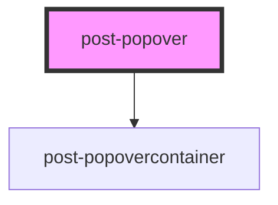

# post-popup

<!-- Auto Generated Below -->

## Properties

| Property                          | Attribute              | Description                                                                                                                                                                                                                                                                                                                | Type                                                                                                                                                                 | Default     |
| --------------------------------- | ---------------------- | -------------------------------------------------------------------------------------------------------------------------------------------------------------------------------------------------------------------------------------------------------------------------------------------------------------------------- | -------------------------------------------------------------------------------------------------------------------------------------------------------------------- | ----------- |
| `arrow`                           | `arrow`                | Show a little indicator arrow                                                                                                                                                                                                                                                                                              | `boolean`                                                                                                                                                            | `true`      |
| `closeButtonCaption` _(required)_ | `close-button-caption` | Define the caption of the close button for assistive technology                                                                                                                                                                                                                                                            | `string`                                                                                                                                                             | `undefined` |
| `placement`                       | `placement`            | Defines the placement of the popover according to the floating-ui options available at https://floating-ui.com/docs/computePosition#placement. Popoverss are automatically flipped to the opposite side if there is not enough available space and are shifted towards the viewport if they would overlap edge boundaries. | `"bottom" \| "bottom-end" \| "bottom-start" \| "left" \| "left-end" \| "left-start" \| "right" \| "right-end" \| "right-start" \| "top" \| "top-end" \| "top-start"` | `'top'`     |

## Methods

### `hide() => Promise<void>`

Programmatically hide this popover

#### Returns

Type: `Promise<void>`

### `show(target: HTMLElement) => Promise<void>`

Programmatically display the popover

#### Returns

Type: `Promise<void>`

### `toggle(target: HTMLElement, force?: boolean) => Promise<void>`

Toggle popover display

#### Returns

Type: `Promise<void>`

## Dependencies

### Depends on

- [post-popovercontainer](../post-popovercontainer)

### Graph

----------------------------------------------

*Built with [StencilJS](https://stenciljs.com/)*
