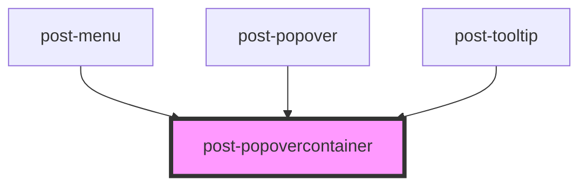

# post-popover

<!-- Auto Generated Below -->

## Properties

| Property      | Attribute      | Description                                                                                                                                                                                                                                                                                                                                 | Type                                                                                                                                                                 | Default     |
| ------------- | -------------- | ------------------------------------------------------------------------------------------------------------------------------------------------------------------------------------------------------------------------------------------------------------------------------------------------------------------------------------------- | -------------------------------------------------------------------------------------------------------------------------------------------------------------------- | ----------- |
| `animation`   | `animation`    | Animation style                                                                                                                                                                                                                                                                                                                             | `"none" \| "pop-in"`                                                                                                                                                 | `null`      |
| `arrow`       | `arrow`        | Whether or not to display a little pointer arrow                                                                                                                                                                                                                                                                                            | `boolean`                                                                                                                                                            | `false`     |
| `edgeGap`     | `edge-gap`     | Gap between the edge of the page and the popovercontainer                                                                                                                                                                                                                                                                                   | `number`                                                                                                                                                             | `8`         |
| `manualClose` | `manual-close` | Whether or not the popovercontainer should close when user clicks outside of it                                                                                                                                                                                                                                                             | `boolean`                                                                                                                                                            | `false`     |
| `placement`   | `placement`    | Defines the placement of the popovercontainer according to the floating-ui options available at https://floating-ui.com/docs/computePosition#placement. Popovercontainers are automatically flipped to the opposite side if there is not enough available space and are shifted towards the viewport if they would overlap edge boundaries. | `"bottom" \| "bottom-end" \| "bottom-start" \| "left" \| "left-end" \| "left-start" \| "right" \| "right-end" \| "right-start" \| "top" \| "top-end" \| "top-start"` | `'top'`     |
| `safeSpace`   | `safe-space`   | Enables a safespace through which the cursor can be moved without the popover being disabled                                                                                                                                                                                                                                                | `"trapezoid" \| "triangle"`                                                                                                                                          | `undefined` |

## Events

| Event              | Description                                                                                                                                                                                                          | Type                                  |
| ------------------ | -------------------------------------------------------------------------------------------------------------------------------------------------------------------------------------------------------------------- | ------------------------------------- |
| `postBeforeShow`   | Fires whenever the popovercontainer is about to be shown, passing in event.detail a `first` boolean, which is true if it is to be shown for the first time.                                                          | `CustomEvent<{ first?: boolean; }>`   |
| `postBeforeToggle` | Fires whenever the popovercontainer is about to be shown or hidden, passing in event.detail a `willOpen` boolean, which is true if the popovercontainer is about to be opened and false if it is about to be closed. | `CustomEvent<{ willOpen: boolean; }>` |
| `postHide`         | Fires whenever the popovercontainer is hidden.                                                                                                                                                                       | `CustomEvent<any>`                    |
| `postShow`         | Fires whenever the popovercontainer is shown, passing in event.detail a `first` boolean, which is true if it is shown for the first time.                                                                            | `CustomEvent<{ first?: boolean; }>`   |
| `postToggle`       | Fires whenever the popovercontainer gets shown or hidden, passing in event.detail an object containing a `isOpen`boolean, which is true if the popovercontainer was opened and false if it was closed.               | `CustomEvent<{ isOpen: boolean; }>`   |

## Methods

### `close() => Promise<void>`

Handles the popover closing process and emits related events.

#### Returns

Type: `Promise<void>`

### `hide() => Promise<void>`

Programmatically hide the popovercontainer

#### Returns

Type: `Promise<void>`

### `open() => Promise<void>`

Handles the popover opening process and emits related events.

#### Returns

Type: `Promise<void>`

### `show(target: HTMLElement) => Promise<void>`

Programmatically display the popovercontainer

#### Parameters

| Name     | Type          | Description                                                                |
| -------- | ------------- | -------------------------------------------------------------------------- |
| `target` | `HTMLElement` | A focusable element inside the trigger component that controls the popover |

#### Returns

Type: `Promise<void>`

### `toggle(target: HTMLElement, force?: boolean) => Promise<boolean>`

Toggle popovercontainer display

#### Parameters

| Name     | Type          | Description                                                                |
| -------- | ------------- | -------------------------------------------------------------------------- |
| `target` | `HTMLElement` | A focusable element inside the trigger component that controls the popover |
| `force`  | `boolean`     | Pass true to always show or false to always hide                           |

#### Returns

Type: `Promise<boolean>`

## Slots

| Slot | Description                                                   |
| ---- | ------------------------------------------------------------- |
|      | Default slot for placing content inside the popovercontainer. |

## Dependencies

### Used by

 - [post-menu](../post-menu)
 - [post-popover](../post-popover)
 - [post-tooltip](../post-tooltip)

### Graph

----------------------------------------------

*Built with [StencilJS](https://stenciljs.com/)*
