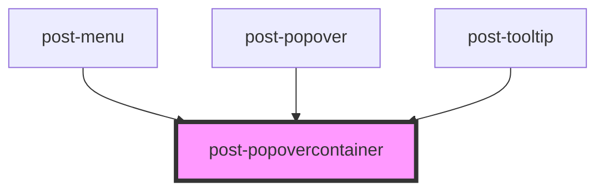

# post-popover

<!-- Auto Generated Below -->

## Properties

| Property      | Attribute      | Description                                                                                                                                                                                                                                                                                                                                   | Type                                                                                                                                                                 | Default     |
| ------------- | -------------- | --------------------------------------------------------------------------------------------------------------------------------------------------------------------------------------------------------------------------------------------------------------------------------------------------------------------------------------------- | -------------------------------------------------------------------------------------------------------------------------------------------------------------------- | ----------- |
| `animation`   | `animation`    | Animation style                                                                                                                                                                                                                                                                                                                               | `"pop-in"`                                                                                                                                                           | `undefined` |
| `arrow`       | `arrow`        | Whether or not to display a little pointer arrow                                                                                                                                                                                                                                                                                              | `boolean`                                                                                                                                                            | `false`     |
| `edgeGap`     | `edge-gap`     | Gap between the edge of the page and the popover-container                                                                                                                                                                                                                                                                                    | `number`                                                                                                                                                             | `8`         |
| `manualClose` | `manual-close` | Whether or not the popover should close when user clicks outside of it                                                                                                                                                                                                                                                                        | `boolean`                                                                                                                                                            | `false`     |
| `placement`   | `placement`    | Defines the placement of the popover-container according to the floating-ui options available at https://floating-ui.com/docs/computePosition#placement. Popover-containers are automatically flipped to the opposite side if there is not enough available space and are shifted towards the viewport if they would overlap edge boundaries. | `"bottom" \| "bottom-end" \| "bottom-start" \| "left" \| "left-end" \| "left-start" \| "right" \| "right-end" \| "right-start" \| "top" \| "top-end" \| "top-start"` | `'top'`     |

## Events

| Event        | Description                                                                                                    | Type                   |
| ------------ | -------------------------------------------------------------------------------------------------------------- | ---------------------- |
| `postToggle` | Fires whenever the popover-container gets shown or hidden, passing the new state in event.details as a boolean | `CustomEvent<boolean>` |

## Methods

### `hide() => Promise<void>`

Programmatically hide the popover-container

#### Returns

Type: `Promise<void>`

### `show(target: HTMLElement) => Promise<void>`

Programmatically display the popover-container

#### Parameters

| Name     | Type          | Description                                                                            |
| -------- | ------------- | -------------------------------------------------------------------------------------- |
| `target` | `HTMLElement` | An element with [data-popover-target="id"] where the popover-container should be shown |

#### Returns

Type: `Promise<void>`

### `toggle(target: HTMLElement, force?: boolean) => Promise<boolean>`

Toggle popover-container display

#### Parameters

| Name     | Type          | Description                                                                            |
| -------- | ------------- | -------------------------------------------------------------------------------------- |
| `target` | `HTMLElement` | An element with [data-popover-target="id"] where the popover-container should be shown |
| `force`  | `boolean`     | Pass true to always show or false to always hide                                       |

#### Returns

Type: `Promise<boolean>`

## Slots

| Slot | Description                                                    |
| ---- | -------------------------------------------------------------- |
|      | Default slot for placing content inside the popover-container. |

## Dependencies

### Used by

 - [post-menu](../post-menu)
 - [post-popover](../post-popover)
 - [post-tooltip](../post-tooltip)

### Graph

----------------------------------------------

*Built with [StencilJS](https://stenciljs.com/)*
