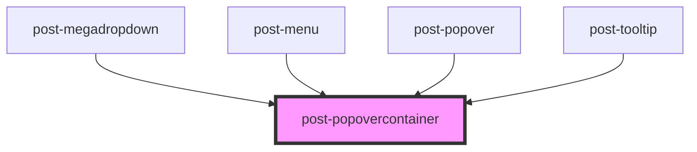

# post-popover

<!-- Auto Generated Below -->

## Properties

| Property    | Attribute   | Description                                                                                                                                                                                                                                                                                                               | Type                                                                                                                                                                 | Default |
| ----------- | ----------- | ------------------------------------------------------------------------------------------------------------------------------------------------------------------------------------------------------------------------------------------------------------------------------------------------------------------------- | -------------------------------------------------------------------------------------------------------------------------------------------------------------------- | ------- |
| `arrow`     | `arrow`     | Wheter or not to display a little pointer arrow                                                                                                                                                                                                                                                                           | `boolean`                                                                                                                                                            | `false` |
| `edgeGap`   | `edge-gap`  | Gap between the edge of the page and the popover                                                                                                                                                                                                                                                                          | `number`                                                                                                                                                             | `8`     |
| `placement` | `placement` | Defines the placement of the tooltip according to the floating-ui options available at https://floating-ui.com/docs/computePosition#placement. Tooltips are automatically flipped to the opposite side if there is not enough available space and are shifted towards the viewport if they would overlap edge boundaries. | `"bottom" \| "bottom-end" \| "bottom-start" \| "left" \| "left-end" \| "left-start" \| "right" \| "right-end" \| "right-start" \| "top" \| "top-end" \| "top-start"` | `'top'` |

## Events

| Event        | Description                                                                                          | Type                   |
| ------------ | ---------------------------------------------------------------------------------------------------- | ---------------------- |
| `postToggle` | Fires whenever the popover gets shown or hidden, passing the new state in event.details as a boolean | `CustomEvent<boolean>` |

## Methods

### `hide() => Promise<void>`

Programmatically hide this tooltip

#### Returns

Type: `Promise<void>`

### `show(target: HTMLElement) => Promise<void>`

Programmatically display the tooltip

#### Parameters

| Name     | Type          | Description                                                                  |
| -------- | ------------- | ---------------------------------------------------------------------------- |
| `target` | `HTMLElement` | An element with [data-tooltip-target="id"] where the tooltip should be shown |

#### Returns

Type: `Promise<void>`

### `toggle(target: HTMLElement, force?: boolean) => Promise<boolean>`

Toggle tooltip display

#### Parameters

| Name     | Type          | Description                                                                  |
| -------- | ------------- | ---------------------------------------------------------------------------- |
| `target` | `HTMLElement` | An element with [data-tooltip-target="id"] where the tooltip should be shown |
| `force`  | `boolean`     | Pass true to always show or false to always hide                             |

#### Returns

Type: `Promise<boolean>`

## Slots

| Slot | Description                                                   |
| ---- | ------------------------------------------------------------- |
|      | Default slot for placing content inside the popovercontainer. |

## Dependencies

### Used by

 - [post-megadropdown](../post-megadropdown)
 - [post-menu](../post-menu)
 - [post-popover](../post-popover)
 - [post-tooltip](../post-tooltip)

### Graph

----------------------------------------------

*Built with [StencilJS](https://stenciljs.com/)*
