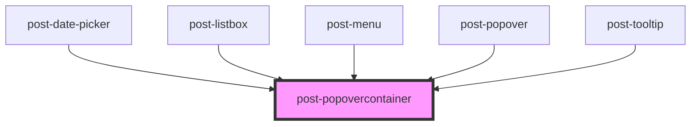

# post-popovercontainer

<!-- Auto Generated Below -->

## Properties

| Property    | Attribute    | Description                                                                                                                                                                                                  | Type                                                                                                                                                                 | Default     |
| ----------- | ------------ | ------------------------------------------------------------------------------------------------------------------------------------------------------------------------------------------------------------ | -------------------------------------------------------------------------------------------------------------------------------------------------------------------- | ----------- |
| `arrow`     | `arrow`      | Show a little indicator arrow                                                                                                                                                                                | `boolean`                                                                                                                                                            | `false`     |
| `autoHide`  | `auto-hide`  | Whether to automatically hide the popover when the anchor moves outside the scrollport.  If the `post-header` can cover the anchor, the popover will also be hidden as soon as the anchor scrolls behind it. | `boolean`                                                                                                                                                            | `undefined` |
| `autoSize`  | `auto-size`  | Whether to automatically size the popover to fit the available space in the viewport.  If the `post-header` can cover the anchor, it is excluded from the available space.                                   | `boolean`                                                                                                                                                            | `undefined` |
| `edgeGap`   | `edge-gap`   | Gap between the edge of the viewport and the popover.                                                                                                                                                        | `number`                                                                                                                                                             | `8`         |
| `offset`    | `offset`     | Offset for more precise placement                                                                                                                                                                            | `number`                                                                                                                                                             | `undefined` |
| `placement` | `placement`  | Placement of the popover according to the floating-ui options.                                                                                                                                               | `"bottom" \| "bottom-end" \| "bottom-start" \| "left" \| "left-end" \| "left-start" \| "right" \| "right-end" \| "right-start" \| "top" \| "top-end" \| "top-start"` | `'top'`     |
| `safeSpace` | `safe-space` | Whether to add a space through which the mouse can move without the popover being hidden.                                                                                                                    | `boolean`                                                                                                                                                            | `undefined` |

## Events

| Event              | Description                                                                                                                                                                                      | Type                                  |
| ------------------ | ------------------------------------------------------------------------------------------------------------------------------------------------------------------------------------------------ | ------------------------------------- |
| `postBeforeShow`   | Emitted just before the popover is shown.  The payload contains a `first` boolean, that is set to `true` when the popover is about to be shown for the first time.                               | `CustomEvent<{ first?: boolean; }>`   |
| `postBeforeToggle` | Emitted just before the popover's state changes.  The payload contains a `willOpen` boolean, that is set to `true` when the popover is about to be shown, `false` when it is about to be hidden. | `CustomEvent<{ willOpen: boolean; }>` |
| `postHide`         | Emitted just after the popover is hidden.                                                                                                                                                        | `CustomEvent<any>`                    |
| `postShow`         | Emitted just after the popover is shown.  The payload contains a `first` boolean, that is set to `true` when the popover is shown for the first time.                                            | `CustomEvent<{ first?: boolean; }>`   |
| `postToggle`       | Emitted just after the popover's state changes.  The payload contains a `isOpen` boolean, that is set to `true` when the popover is shown, `false` when it is hidden.                            | `CustomEvent<{ isOpen: boolean; }>`   |

## Methods

### `hide() => Promise<void>`

Hides the popover.

#### Returns

Type: `Promise<void>`

### `show(anchor: HTMLElement) => Promise<void>`

Shows the popover.

#### Parameters

| Name     | Type          | Description                                           |
| -------- | ------------- | ----------------------------------------------------- |
| `anchor` | `HTMLElement` | the element that the popover is visually anchored to. |

#### Returns

Type: `Promise<void>`

### `toggle(anchor: HTMLElement, force?: boolean) => Promise<boolean>`

Toggles the popover's state from hidden to showing and vice versa.

If `state` is specified, the popover is forced to be shown if the is set to `true`, or hidden
if it is set to `false`.

#### Parameters

| Name     | Type          | Description                                           |
| -------- | ------------- | ----------------------------------------------------- |
| `anchor` | `HTMLElement` | the element that the popover is visually anchored to. |
| `force`  | `boolean`     | the next state of the popover.                        |

#### Returns

Type: `Promise<boolean>`

the new state of the popover: `true` if it is shown, `false` if it is hidden.

## Slots

| Slot | Description                                          |
| ---- | ---------------------------------------------------- |
|      | Default slot for placing content inside the popover. |

## Shadow Parts

| Part                                  | Description |
| ------------------------------------- | ----------- |
| `"post-popovercontainer-border-mask"` |             |
| `"post-popovercontainer-content"`     |             |

## Dependencies

### Used by

 - [post-date-picker](../post-date-picker)
 - [post-listbox](../post-listbox)
 - [post-menu](../post-menu)
 - [post-popover](../post-popover)
 - [post-tooltip](../post-tooltip)

### Graph

```mermaid
graph TD;
  post-date-picker --> post-popovercontainer
  post-listbox --> post-popovercontainer
  post-menu --> post-popovercontainer
  post-popover --> post-popovercontainer
  post-tooltip --> post-popovercontainer
  style post-popovercontainer fill:#f9f,stroke:#333,stroke-width:4px
```

----------------------------------------------

*Built with [StencilJS](https://stenciljs.com/)*
