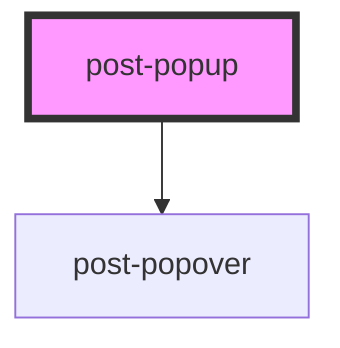

# post-popup

<!-- Auto Generated Below -->

## Properties

| Property    | Attribute   | Description                                                                                                                                                                                                                                                                                                           | Type                                                                                                                                                                 | Default       |
| ----------- | ----------- | --------------------------------------------------------------------------------------------------------------------------------------------------------------------------------------------------------------------------------------------------------------------------------------------------------------------- | -------------------------------------------------------------------------------------------------------------------------------------------------------------------- | ------------- |
| `placement` | `placement` | Defines the placement of the popup according to the floating-ui options available at https://floating-ui.com/docs/computePosition#placement. Popups are automatically flipped to the opposite side if there is not enough available space and are shifted towards the viewport if they would overlap edge boundaries. | `"bottom" \| "bottom-end" \| "bottom-start" \| "left" \| "left-end" \| "left-start" \| "right" \| "right-end" \| "right-start" \| "top" \| "top-end" \| "top-start"` | `'right-end'` |

## Methods

### `hide() => Promise<void>`

Programmatically hide this popup

#### Returns

Type: `Promise<void>`

### `show(target: HTMLElement) => Promise<void>`

Programmatically display the popup

#### Returns

Type: `Promise<void>`

### `toggle(target: HTMLElement, force?: boolean) => Promise<void>`

Toggle popup display

#### Returns

Type: `Promise<void>`

## Dependencies

### Depends on

- [post-popover](../post-popover)

### Graph

----------------------------------------------

*Built with [StencilJS](https://stenciljs.com/)*
