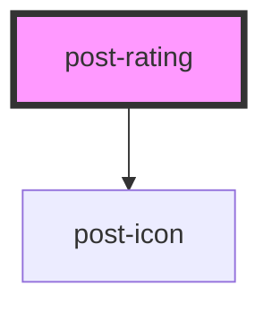

# post-rating

<!-- Auto Generated Below -->

## Properties

| Property        | Attribute        | Description                                                                         | Type      | Default |
| --------------- | ---------------- | ----------------------------------------------------------------------------------- | --------- | ------- |
| `currentRating` | `current-rating` | The current rating value                                                            | `number`  | `0`     |
| `disabled`      | `disabled`       | Boolean for the disabled state of the component                                     | `boolean` | `false` |
| `readonly`      | `readonly`       | If readonly is `true`, the component only displays a rating and is not interactive. | `boolean` | `false` |
| `stars`         | `stars`          | The number of stars in the rating                                                   | `number`  | `5`     |

## Events

| Event    | Description                                 | Type                  |
| -------- | ------------------------------------------- | --------------------- |
| `change` | Event emitted when the rating gets commited | `CustomEvent<number>` |
| `input`  | Event emitted whenever the rating changes   | `CustomEvent<number>` |

## Dependencies

### Depends on

- [post-icon](../post-icon)

### Graph

----------------------------------------------

*Built with [StencilJS](https://stenciljs.com/)*
