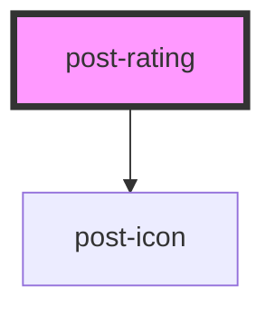

# post-rating

<!-- Auto Generated Below -->

## Properties

| Property        | Attribute        | Description                                                                                                          | Type      | Default    |
| --------------- | ---------------- | -------------------------------------------------------------------------------------------------------------------- | --------- | ---------- |
| `currentRating` | `current-rating` | Defines the rating that the component should show.                                                                   | `number`  | `0`        |
| `label`         | `label`          | Defines a hidden label for the component.                                                                            | `string`  | `'Rating'` |
| `readonly`      | `readonly`       | Defines if the component is readonly or not. This usually should be used together with the `currentRating` property. | `boolean` | `false`    |
| `stars`         | `stars`          | Defines the total amount of stars rendered in the component.                                                         | `number`  | `5`        |

## Events

| Event        | Description                                                                                                                          | Type                              |
| ------------ | ------------------------------------------------------------------------------------------------------------------------------------ | --------------------------------- |
| `postChange` | An event emitted whenever the component's value has changed (on blur). The event payload can be used like so: `event.detail.value`.  | `CustomEvent<{ value: number; }>` |
| `postInput`  | An event emitted whenever the component's value has changed (on input). The event payload can be used like so: `event.detail.value`. | `CustomEvent<{ value: number; }>` |

## Dependencies

### Depends on

- [post-icon](../post-icon)

### Graph

----------------------------------------------

*Built with [StencilJS](https://stenciljs.com/)*
