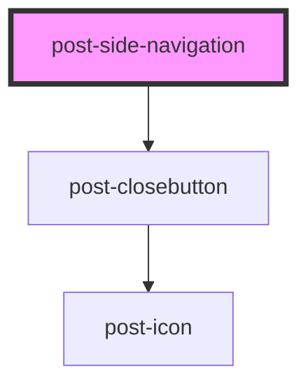

# post-side-navigation

<!-- Auto Generated Below -->

## Properties

| Property                 | Attribute    | Description                                                                  | Type     | Default     |
| ------------------------ | ------------ | ---------------------------------------------------------------------------- | -------- | ----------- |
| `textClose` _(required)_ | `text-close` | Accessible label for the close button shown in the mobile navigation dialog. | `string` | `undefined` |

## Events

| Event        | Description                                                                                                                                            | Type                   |
| ------------ | ------------------------------------------------------------------------------------------------------------------------------------------------------ | ---------------------- |
| `postToggle` | An event emitted when the navigation is shown or hidden on mobile. The payload is a boolean: `true` when the navigation opens, `false` when it closes. | `CustomEvent<boolean>` |

## Methods

### `hide() => Promise<void>`

Closes the navigation programmatically.
No-op on desktop.

#### Returns

Type: `Promise<void>`

### `show() => Promise<void>`

Opens the navigation programmatically.
No-op on desktop.

#### Returns

Type: `Promise<void>`

### `toggle() => Promise<void>`

Toggles the navigation programmatically.
No-op on desktop.

#### Returns

Type: `Promise<void>`

## Slots

| Slot        | Description                                                                      |
| ----------- | -------------------------------------------------------------------------------- |
| `"default"` | Slot for the navigation content (must be a `<nav>` landmark with proper heading) |

## Dependencies

### Depends on

- [post-closebutton](../post-closebutton)

### Graph

----------------------------------------------

*Built with [StencilJS](https://stenciljs.com/)*
