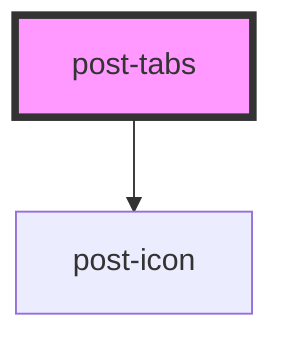

# post-tabs

<!-- Auto Generated Below -->

## Properties

| Property    | Attribute    | Description                                                                                                                                                                    | Type                 | Default     |
| ----------- | ------------ | ------------------------------------------------------------------------------------------------------------------------------------------------------------------------------ | -------------------- | ----------- |
| `activeTab` | `active-tab` | The name of the tab in the Content Tabs variant that is initially active. Changing this value after initialization has no effect. If not specified, defaults to the first tab. | `string`             | `undefined` |
| `fullWidth` | `full-width` | When set to true, this property allows the tabs container to span the Changing this value after initialization has no effect. full width of the screen, from edge to edge.     | `boolean`            | `false`     |
| `label`     | `label`      | The accessible label for the Content Tabs variant.                                                                                                                             | `string`             | `undefined` |
| `size`      | `size`       | The size of the tabs, corresponding to the different designs in Figma. Default is 'large'.                                                                                     | `"large" \| "small"` | `'large'`   |

## Events

| Event        | Description                                                                                                                                                                                            | Type                  |
| ------------ | ------------------------------------------------------------------------------------------------------------------------------------------------------------------------------------------------------ | --------------------- |
| `postChange` | An event emitted after the active tab changes, when the fade in transition of its associated panel is finished. The payload is the name of the newly active tab. Only emitted in Content Tabs variant. | `CustomEvent<string>` |

## Methods

### `show(tabName: string) => Promise<void>`

Shows the panel with the given name and selects its associated tab.
Any other panel that was previously shown becomes hidden and its associated tab is unselected.

#### Parameters

| Name      | Type     | Description |
| --------- | -------- | ----------- |
| `tabName` | `string` |             |

#### Returns

Type: `Promise<void>`

## Slots

| Slot        | Description                                                                       |
| ----------- | --------------------------------------------------------------------------------- |
| `"default"` | Slot for placing tab items. Each tab item should be a <post-tab-item> element.    |
| `"panels"`  | Slot for placing tab panels. Each tab panel should be a <post-tab-panel> element. |

## Shadow Parts

| Part                  | Description                                                                                                     |
| --------------------- | --------------------------------------------------------------------------------------------------------------- |
| `"post-tabs"`         | The container element that holds the set of tabs.                                                               |
| `"post-tabs-content"` | The container element that displays the content of the currently active tab. Only available in Content variant. |

## Dependencies

### Depends on

- [post-icon](../post-icon)

### Graph

----------------------------------------------

*Built with [StencilJS](https://stenciljs.com/)*
