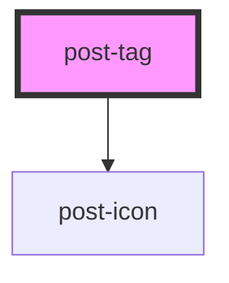

# tag

<!-- Auto Generated Below -->

## Properties

| Property | Attribute | Description                                                                                                                                                                                                                                           | Type     | Default      |
| -------- | --------- | ----------------------------------------------------------------------------------------------------------------------------------------------------------------------------------------------------------------------------------------------------- | -------- | ------------ |
| `color`  | `color`   | Sets the background color of the tag as well as the matching text color. Expected values: ['gray', 'white', info, 'success', 'error', 'warning', 'yellow'] default vaue: 'gray'                                                                       | `string` | `'gray'`     |
| `icon`   | `icon`    | Defines which icon from the swisspost icon library is used. Excpects a number. If there is no value asigned to it no icon will be rendered. Check the desing-system.post documentation to see all available icons.  PS: Values 0 and null are ignored | `number` | `undefined`  |
| `size`   | `size`    | Sets the size (height) of the tag. Also affects the size of the icon. Expected values: post-tag -> large (default) post-tag-sm -> small                                                                                                               | `string` | `'post-tag'` |

## Dependencies

### Depends on

- [post-icon](../post-icon)

### Graph

----------------------------------------------

*Built with [StencilJS](https://stenciljs.com/)*
