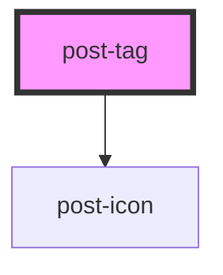

# tag

<!-- Auto Generated Below -->

## Properties

| Property  | Attribute | Description                                                                                                                                                                                                                                                                                        | Type                                                                           | Default     |
| --------- | --------- | -------------------------------------------------------------------------------------------------------------------------------------------------------------------------------------------------------------------------------------------------------------------------------------------------- | ------------------------------------------------------------------------------ | ----------- |
| `icon`    | `icon`    | Defines the icon `name` inside of the component. If not set the icon will not show up. To learn which icons are available, please visit our <a href="/?path=/docs/5704bdc4-c5b5-45e6-b123-c54d01fce2f1--docs" target="_blank">icon library</a>. | `string`                                                                       | `null`      |
| `size`    | `size`    | Defines the size of the component.                                                                                                                                                                                                                                                                 | `"sm"`                                                                         | `null`      |
| `text`    | `text`    | Defines the text of the component. Most of the time this will fit your needs, if you need to add custom content, use the default slot instead.                                                                                                                                                     | `string`                                                                       | `undefined` |
| `variant` | `variant` | Defines the color variant of the component.                                                                                                                                                                                                                                                        | `"error" \| "gray" \| "info" \| "success" \| "warning" \| "white" \| "yellow"` | `'gray'`    |

## Slots

| Slot        | Description                                                                                                                                                                                                                                                                      |
| ----------- | -------------------------------------------------------------------------------------------------------------------------------------------------------------------------------------------------------------------------------------------------------------------------------- |
| `"default"` | Content to place in the `default` slot.
Markup accepted: <a href="https://developer.mozilla.org/en-US/docs/Glossary/Inline-level_content" target="_blank">inline content</a>.

If set, it overrides the components `text` property.
 |

## Dependencies

### Depends on

- [post-icon](../post-icon)

### Graph

----------------------------------------------

*Built with [StencilJS](https://stenciljs.com/)*
