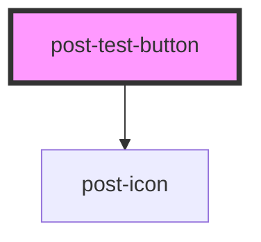

# post-test-form

<!-- Auto Generated Below -->

## Properties

| Property | Attribute | Description    | Type     | Default     |
| -------- | --------- | -------------- | -------- | ----------- |
| `theId`  | `the-id`  | Defines the id | `string` | `undefined` |

## Dependencies

### Depends on

- [post-icon](../post-icon)

### Graph

----------------------------------------------

*Built with [StencilJS](https://stenciljs.com/)*
