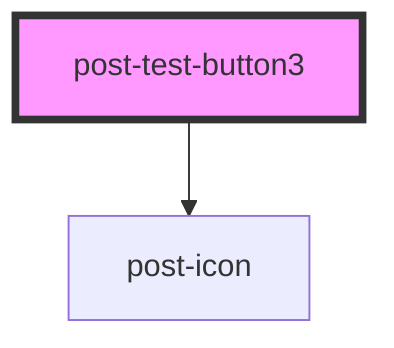

# post-test-form

<!-- Auto Generated Below -->

## Properties

| Property            | Attribute             | Description                     | Type     | Default     |
| ------------------- | --------------------- | ------------------------------- | -------- | ----------- |
| `ariaDescribedbyId` | `aria-describedby-id` | Defines the ariaDescribedbyId   | `string` | `undefined` |
| `ariaLabelledbyId`  | `aria-labelledby-id`  | Defines the ariaLabelledbyId    | `string` | `undefined` |
| `workaround`        | `workaround`          | Defines the selected workaround | `string` | `undefined` |

## Dependencies

### Depends on

- [post-icon](../post-icon)

### Graph

----------------------------------------------

*Built with [StencilJS](https://stenciljs.com/)*
