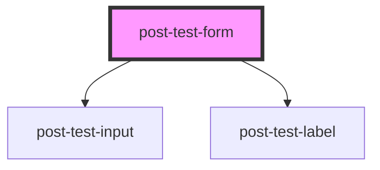

# post-test-form

<!-- Auto Generated Below -->

## Properties

| Property | Attribute  | Description     | Type     | Default     |
| -------- | ---------- | --------------- | -------- | ----------- |
| `theId`  | `the-id`   | Defines the id  | `string` | `undefined` |
| `theId2` | `the-id-2` | Defines the id2 | `string` | `undefined` |

## Dependencies

### Depends on

- [post-test-input](../post-test-input)
- [post-test-label](../post-test-label)

### Graph

----------------------------------------------

*Built with [StencilJS](https://stenciljs.com/)*
