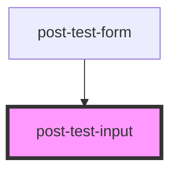

# post-test-input

<!-- Auto Generated Below -->

## Properties

| Property  | Attribute  | Description         | Type     | Default     |
| --------- | ---------- | ------------------- | -------- | ----------- |
| `inputId` | `input-id` | Defines the inputId | `string` | `undefined` |

## Dependencies

### Used by

 - [post-test-form](../post-test-form)

### Graph

----------------------------------------------

*Built with [StencilJS](https://stenciljs.com/)*
